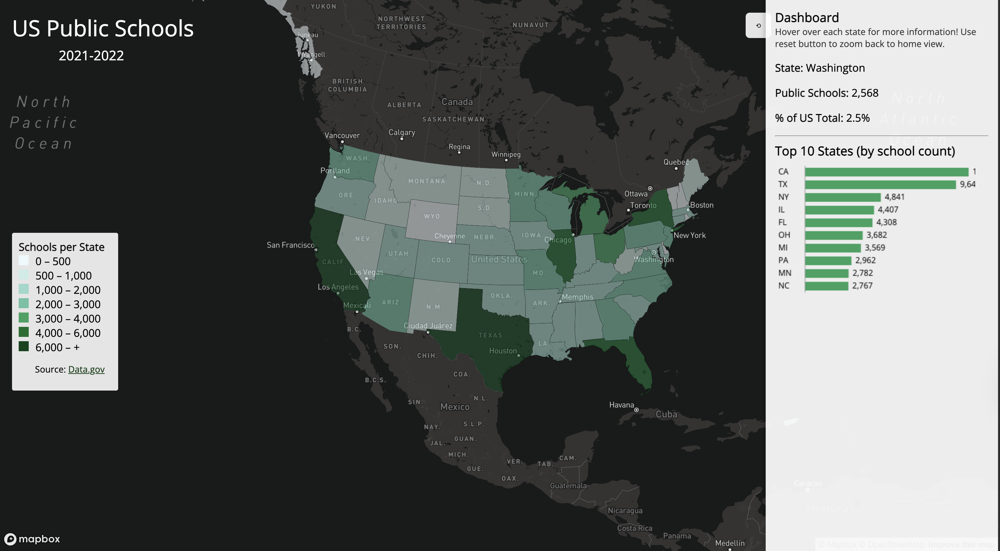

# smart-dashboard-public-schools-2021-2022
# Smart Dashboard of US Public Schools in 2021-2022

AI Disclosure: I used AI in this assignment to locate shapefile sources.

## Project Introduction
This project provides an interactive web maps that visualize public school locations in 2021 to 2022 on a state count level. The side panel displays a chart listing the top 10 states with the most schools, the state name, total of public schools in that state, and the percentage of the US total schools the state makes up.

**Choropleth Map: US Public Schools 2021-2022**  
https://maikhanhvt.github.io/smart-dashboard-public-schools-2021-2022/
  

## Data Source
- **Public School Locations 2021-22 - GEOJSON:** The National Center for Education Statistics' (NCES) Education Demographic and Geographic Estimate (EDGE) program (https://catalog.data.gov/dataset/public-school-locations-2021-22-5a116)
- **Cartographic Boundary Files - Shapefile** (https://www.census.gov/geographies/mapping-files/time-series/geo/carto-boundary-file.html)
- 2 files above used to count the number of points in each polygon (state) through QGIS and create a new GeoJSON with those counts to create new dataset for choropleth display.

---

## Primary Functionalities
- Interactive map, visualizing comparing counts of public schools in the US
- Colored and scaled legend
- Uses Mapbox GL expression functions `step` and `get` to classify numeric data
- hover over states displays state name and more data (interactive)
- Sequential color gradient represents the state polygons
- "reset" button that sets back to home view
- numeric chart of states with most schools in the US

---

## Libraries & Resources Used
- Mapbox GL JS
- QGIS